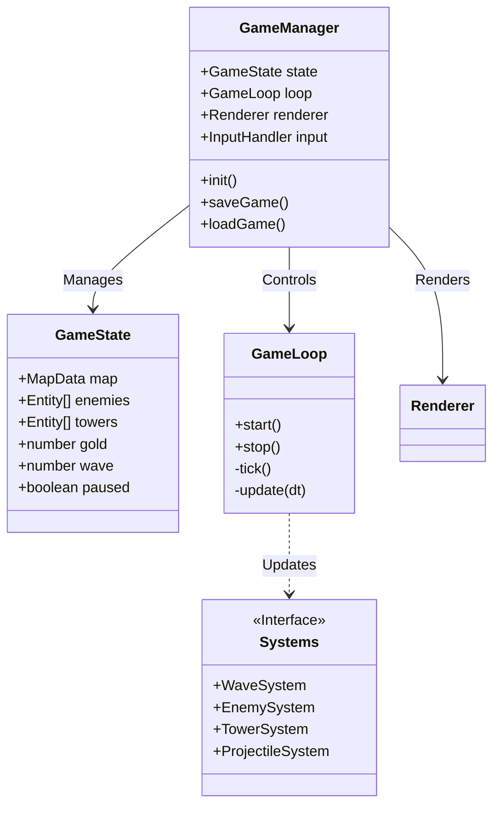
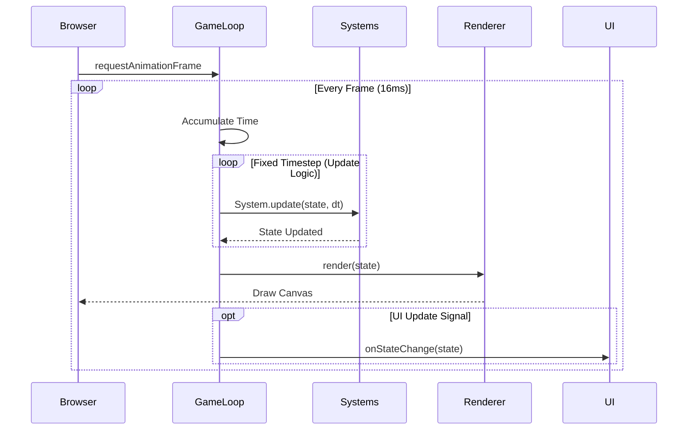

# Ball Defense - 서버리스 타워 디펜스

Next.js 14와 HTML5 Canvas로 제작된 상용 수준의 서버리스 타워 디펜스 게임입니다.

## 🌟 주요 기능 (Features)

- **서버리스 (Serverless)**: 모든 로직이 브라우저에서 실행되며, `LocalStorage`를 통해 게임 상태가 영구 저장됩니다.
- **반응형 디자인 (Responsive)**: 모바일 터치 조작과 데스크탑 마우스 입력을 모두 지원하는 모바일 우선 설계.
- **고성능 (Performance)**: 60fps를 목표로 최적화된 Canvas 렌더링 루프.
- **풍부한 콘텐츠**:
  - **3가지 맵**: 초급(Beginner), 갈림길(Split), 나선형(Spiral)
  - **6종의 적**: 러너, 브루트, 스웜, 보호막, 마법 저항 등 다양한 유닛
  - **6종의 타워**: 물리/마법/범위/지속피해/CC 등 3단계 업그레이드 지원
  - **12단계 웨이브**: 정교하게 밸런싱된 난이도 곡선

## 🎮 조작법 (Controls)

- **화면 이동 (Pan)**: 맵을 드래그하여 시점 이동 (터치/마우스).
- **정보 확인 (Select)**: 타일이나 유닛을 터치/클릭하여 정보 확인.
- **건설 (Build)**: 빈 타일을 선택하여 건설 메뉴 열기.
- **업그레이드/판매**: 설치된 타워를 선택하여 관리 메뉴 열기.
- **HUD**: 상단에서 현재 웨이브, 골드, 생명력 확인. 일시정지 및 배속 조절 가능.

## 🛠 시스템 설계 (System Design)

이 게임은 데이터 지향적 설계와 고정 시간 간격(Fixed Timestep) 게임 루프를 기반으로 합니다.

### 아키텍처 다이어그램 (Class Diagram)



### 게임 루프 시퀀스 (Game Loop Sequence)



## 💻 개발 환경 (Development)

### 필수 요구사항
- Node.js 18+
- npm

### 설치 (Installation)
```bash
npm install
```

### 로컬 실행 (Run Locally)
```bash
npm run dev
```
브라우저에서 [http://localhost:3000](http://localhost:3000) 접속.

### 빌드 (Build)
```bash
npm run build
```

## 📂 디렉토리 구조
- `src/game/engine`: 핵심 게임 루프, 렌더러, 입력 처리.
- `src/game/data`: 정적 게임 데이터 (적, 타워, 맵, 웨이브).
- `src/game/systems`: 게임 로직 시스템 (웨이브, 적, 타워, 투사체).
- `src/game/state`: GameState 인터페이스 및 상태 관리.
- `src/game/ui`: React UI 컴포넌트 (HUD, 타워 컨트롤).

## 라이선스
MIT
